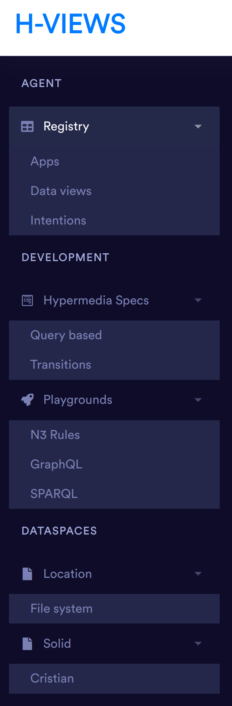

# Hypermedia views

Abandoned prototype.

Add hypermedia views to your app through agents, in a simple way.

# Implementation plan

Principles: 

* Declaration should be simple.
* An H-View can be copied between applications without pain.
* Appropiate for decentralized environments.

# Components:

## Hypermedia spec

A spec defining how a view is generated and then exposed

## H-views playground

Helps a developer to test and generate Hypermedia specs

Source selection
- Shows all preconfigured sources
- Given a pattern, returns selected sources.

Allows to define several api-patterns

Can define the view, being this inference or query. 

## H-views controller

Exposes hypermedia views and handle incoming operations

## Executors

All the specific implementations
